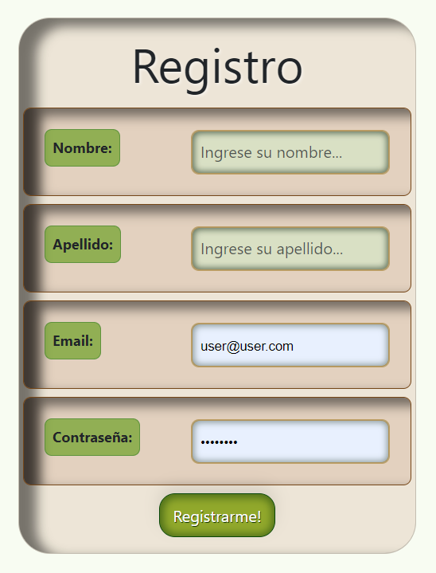
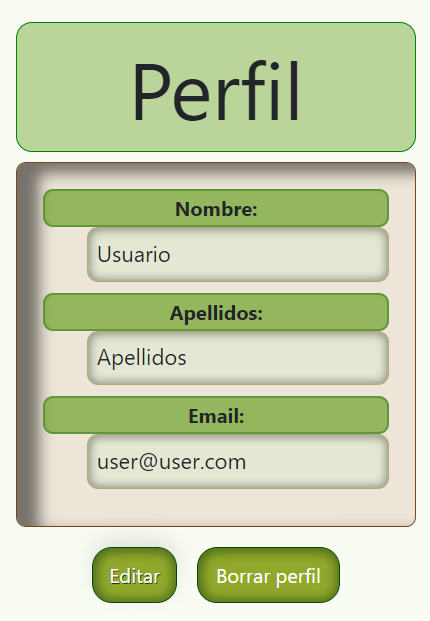
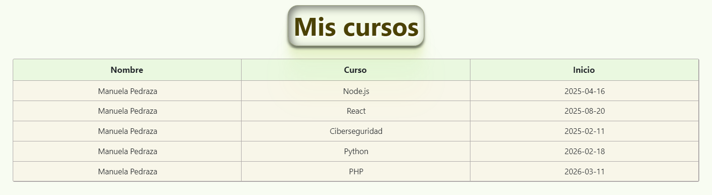
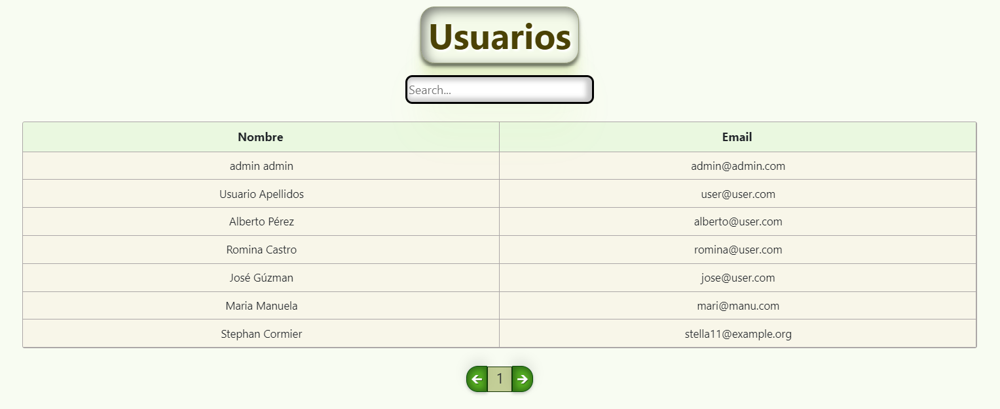

## React-AkdemyProject

Enlace github Backend: https://github.com/jorgemctin/Laravel-AkdemyProject

### Tecnologías:

+ REACT.
+ JAVASCRIPT.
+ REACT BOOTSTRAP.
+ REACT REDUX.
+ HTML.
+ CSS.

### Descripción:

Akdemy es una aplicación de educación con múltiples programas y convocatorias. Los usuarios se registran y acceden a su perfil, donde pueden explorar programas académicos, solicitar inscripciones y editar su información personal. Los administradores gestionan las convocatorias y solicitudes de inscripción. Destacadas características incluyen ver convocatorias vigentes, rastrear el progreso académico y eliminar la cuenta si lo desean. Akdemy brinda una experiencia educativa completa y transparente, con un enfoque en la accesibilidad y facilidad de uso.

 [Deploy frontend:](https://react-akdemy-project.vercel.app/)

Puedes registrarte para una experiencia mas completa, o puedes acceder con estas credenciales: 

Usuario:
user@user.com - Hola1234

Administrador:
admin@admin.com - Hola1234

### REGISTRO/LOGIN

El primer paso será registrarse, para poder acceder a todos los beneficios de la app.

### HOME

La única página que estará disponible para todos será la del Home, para que puedan ver los cursos disponibles de la academia. 

### VISTA DETALLE

Al hacer clic en la imagen, aparecerá a una vista detalle en la que resaltamos los aspectos mas importantes de cada curso, junto con la opción de solicitar su inscripción en caso de ser de interés.

### PERFIL

  
  
  

En su perfil podrá ver, editar y borrar su cuenta en caso de necesitarlo.

### VISTAS USUARIOS/ALUMNOS

Los estudiantes podrán llevar un control de las convocatorias disponibles, cursos en los que están matriculados y solicitar inscripción en la convocatoria disponible de interés.

### CONVOCATORIAS

Tantos los usuarios como los admin tendrán acceso a esta vista y así estar al día con las convocatorias futuras disponibles.

### SOLICITAR INSCRIPCIÓN

En esta vista, podrán solicitar la inscripción en el programa de su interés, comprobando la fecha de inicio, horario y precio, siendo un proceso transparente para el usuario. Luego, los redirigirá a la vista que les indicará que la solicitud se ha procesado correctamente y les proporcionará los documentos necesarios para formalizar la inscripción.

### MIS CURSOS

En el apartado de "Mis cursos", se lleavrá el control de las matrículas aprobadas.

### VISTAS ADMIN

El admin podrá llevar el control total de la aplicación.

### TODOS LOS USUARIOS

Podrá ver todos los usuarios registrados en el sistema, teniendo la posibilidad de buscar por nombre, apellidos, email o id.

### CONVOCATORIAS

Podrá crear las convocatorias necesarias, escogiendo curso, fecha inicio y horarios.

### DETALLE/EDITAR CONVOCATORIAS

En la vista detalle podrá ver toda la información del curso, los alumnos matriculados en el mismo y en caso de necesitarlo también poder editar ya sea el horario, la fecha o el curso en sí.

### SOLICITUDES PENDIENTES

Una vez recibida y aprobada la documentación para la inscripción del alumno, el admin será el responsable de aceptar dicha solicitud y una vez aceptada le figurará al alumno en el apartado de "Mis cursos".

### Agradecimientos:

Agradezco a todos mis profesores y compañeros el tiempo dedicado a este proyecto.

### Licencia y Copyright:

En el desarrollo de este proyecto, he incorporado imágenes y el ícono de diversas fuentes, a las cuales se encuentran:

- [IconFinder](https://www.iconfinder.com)
- [Remove.bg](https://www.remove.bg/)
- [PngHQ](https://pnghq.com/)
- [Freepik](https://www.freepik.es/)
- [ForCode](http://www.forcode.es/)
- [PngEgg](https://www.pngegg.com/)
- [LogoDownload](https://es.logodownload.org/)

### Autor:

Jorge Luis Martin Lorenzo.
