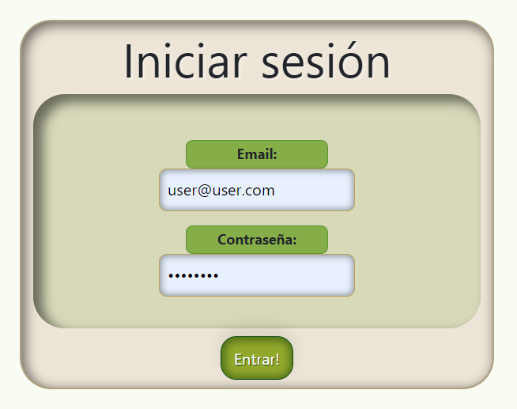

## React-AkdemyProject

<!--  -->

### Tecnologías:

+ REACT.
+ JAVASCRIPT.
+ REACT BOOTSTRAP.
+ REACT REDUX.
+ HTML.
+ CSS.

### Descripción:

AkdemyProject es una aplicación de educación con múltiples programas y convocatorias. Los usuarios se registran y acceden a su perfil, donde pueden explorar programas académicos, solicitar inscripciones y editar su información personal. Los administradores gestionan las convocatorias y solicitudes de inscripción. Destacadas características incluyen ver convocatorias vigentes, rastrear el progreso académico y eliminar la cuenta si lo desean. Akdemy brinda una experiencia educativa completa y transparente, con un enfoque en la accesibilidad y facilidad de uso

### REGISTRO

<!--  -->

El primer paso será registrarse, para poder acceder a todos los beneficios de la app.

### LOGIN

Una vez registrados, se enviará a la página del login para que ingrese el email y contraseña.

### HOME

La única página que estará disponible para todos será la del Home, para que puedan ver los servicios.

### VISTA DETALLE

Al hacer clic en la imagen, aparecerá a una vista detalle para que pueda ver más información del mismo, incluyendo el precio y duración.

### PERFIL

Cuenta con una página para ver y editar datos de usuario en caso de necesitarlo.

### ADMIN

Los Admin, contarán con una vista privada para poder llevar el control de la clínica.

### USUARIOS

El Admin será capaz de ver todos los usuarios registrados en el sistema.

### CITAS ADMIN

En caso de que los doctores/admin deseen buscar todas sus citas, dispondrán de un panel de búsqueda.

### PACIENTES

Los pacientes contarán con una vista privada para solicitar la cita de su interés e incluso modificarla en caso de necesitarlo.

### CITAS PACIENTES

Podrán ver el historial de sus citas.

### VISTA DETALLE DE LA CITA Y OPCIÓN DE MODIFICARLA

Si hacen clic en el botón detalle de la cita, les mostrará el detalle de la misma con opción de modificarla.

### Agradecimientos:

Agradezco a todos mis profesores y compañeros el tiempo dedicado a este proyecto.

### Autor:

Jorge Luis Martin Lorenzo.