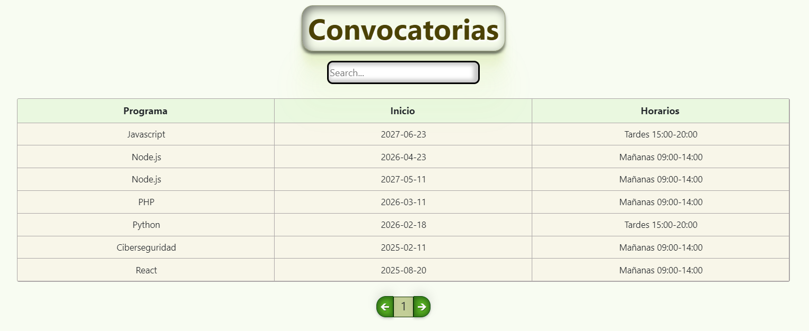
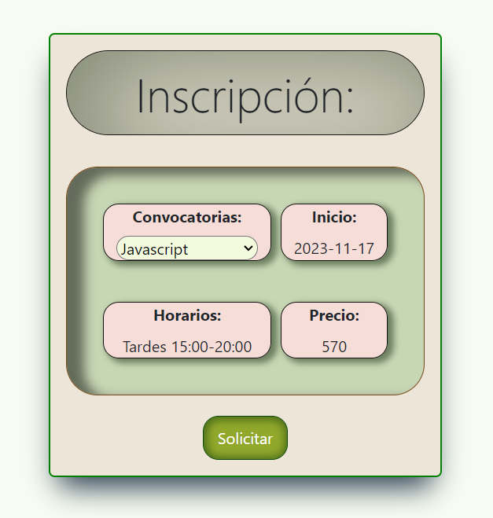
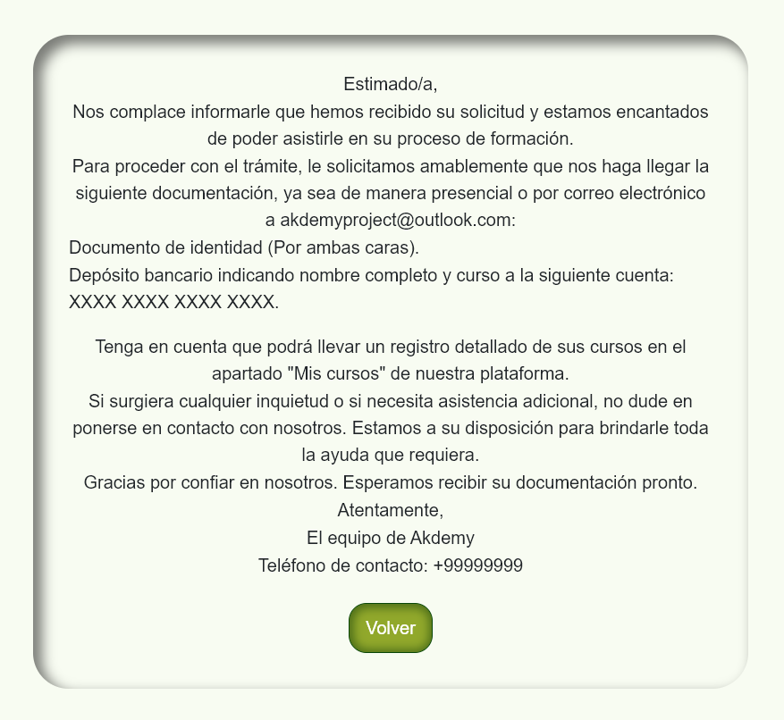
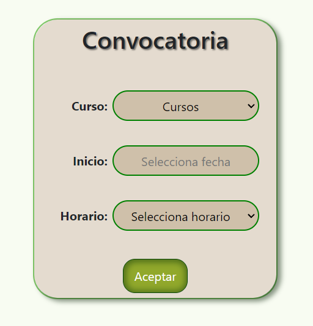
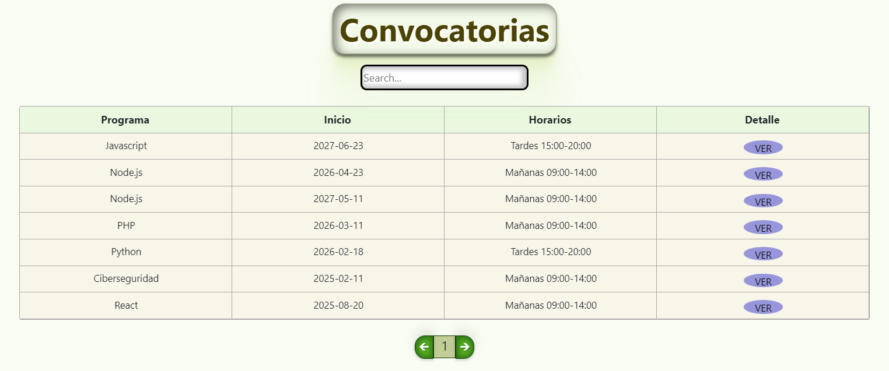
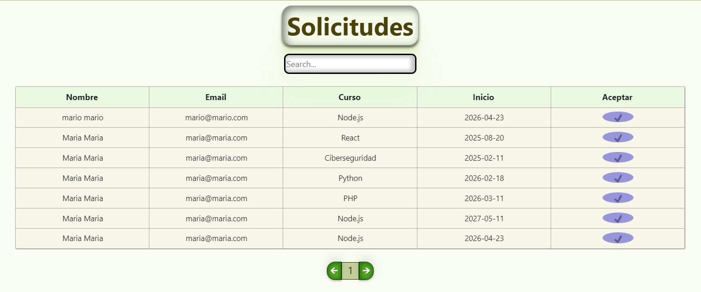

## React-AkdemyProject

#### [Enlace Backend](https://github.com/jorgemctin/Laravel-AkdemyProject)

### Tecnologías:

+ REACT.
+ JAVASCRIPT.
+ REACT BOOTSTRAP.
+ REACT REDUX.
+ HTML.
+ CSS.

### Descripción:

El proyecto Akdemy es una aplicación que ofrece diferentes programas y convocatorias a sus usuarios. Los usuarios pueden registrarse en la academia y acceder a una variedad de funcionalidades según su rol. Los administradores podrán ver todos los usuarios registrados, gestionarán convocatorias y solicitudes de inscripción.

Los usuarios tendrán acceso a su propio perfil, donde podrán visualizar y editar su información personal. Además, podrán explorar todos los programas académicos, obtener detalles sobre cada uno de ellos y tomar decisiones sobre sus intereses educativos. Podrán realizar solicitudes de inscripción a las convocatorias deseadas y, una vez enviada, se les informará la documentación necesaria para completar el proceso. Podrán rastrear el estado de sus solicitudes en el apartado 'mis cursos' dentro de la plataforma, brindándoles una comunicación efectiva y transparente con un enfoque en la accesibilidad y facilidad de uso.

Tendrán disponible salas de mensajería(comentarios) por programa, en donde podrán entablar conversaciones con otros usuarios y contar experiencias sobre los programas académicos. 

##### Puedes registrarte para una experiencia mas completa, o puedes acceder con estas credenciales: 

Usuario:
user@user.com - Hola1234

Administrador:
admin@admin.com - Hola1234

### REGISTRO/LOGIN

El primer paso será registrarse, para poder acceder a todos los beneficios de la app.

### HOME

La única página que estará disponible para todos será la del Home, para que puedan ver los cursos disponibles de la academia. 

### VISTA DETALLE

Al hacer clic en la imagen, aparecerá a una vista detalle en la que resaltamos los aspectos mas importantes de cada curso, junto con la opción de solicitar su inscripción en caso de ser de interés.

### PERFIL

  
  

  

En su perfil podrá ver, editar y borrar su cuenta. En caso de hacer clic en borrar, aparecerá un modal indicándole a que correo debe escribir para recuperar la cuenta si lo desea.

### VISTAS USUARIOS/ALUMNOS

Los estudiantes podrán llevar un control de las convocatorias disponibles, cursos en los que están matriculados y solicitar inscripción en la convocatoria disponible de interés.

### CONVOCATORIAS

Tantos los usuarios como los admin tendrán acceso a esta vista y así estar al día con las convocatorias futuras disponibles.

### SOLICITAR INSCRIPCIÓN

En esta vista, podrán solicitar la inscripción en el programa de su interés, comprobando la fecha de inicio, horario y precio, siendo un proceso transparente para el usuario. Luego, los redirigirá a la vista que les indicará que la solicitud se ha procesado correctamente y les proporcionará los documentos necesarios para formalizar la inscripción. Si un usuario intenta inscribirse nuevamente en la misma convocatoria, se mostrará un modal indicando que la solicitud ya ha sido registrada.

### MIS CURSOS

En el apartado de "Mis cursos", se lleavrá el control de las matrículas aprobadas.

### SALAS

El usuario podrá seleccionar la sala de interés y así interactuar con otros usuarios de la plataforma.

### VISTAS ADMIN

El admin podrá llevar el control total de la aplicación.

### TODOS LOS USUARIOS

Podrá ver todos los usuarios registrados en el sistema, teniendo la posibilidad de buscar por nombre, apellidos, email o id.

### CONVOCATORIAS

Podrá crear las convocatorias necesarias, escogiendo curso, fecha inicio y horarios.

### DETALLE/EDITAR CONVOCATORIAS

En la vista detalle podrá ver toda la información del curso, los alumnos matriculados en el mismo y en caso de necesitarlo también poder editar ya sea el horario, la fecha o el curso en sí.

### SOLICITUDES PENDIENTES

Recibida y aprobada la documentación para la inscripción del alumno, el admin será el responsable de aceptar dicha solicitud y una vez aceptada le figurará al alumno en el apartado de "Mis cursos".

### Agradecimientos:

Agradezco a todos mis profesores y compañeros el tiempo dedicado a este proyecto.

### Licencia y Copyright:

En el desarrollo de este proyecto, he incorporado imágenes y el ícono de diversas fuentes, a las cuales se encuentran:

- [IconFinder](https://www.iconfinder.com)
- [Remove.bg](https://www.remove.bg/)
- [PngHQ](https://pnghq.com/)
- [Freepik](https://www.freepik.es/)
- [ForCode](http://www.forcode.es/)
- [PngEgg](https://www.pngegg.com/)
- [LogoDownload](https://es.logodownload.org/)

### Autor:

Jorge Luis Martin Lorenzo.
